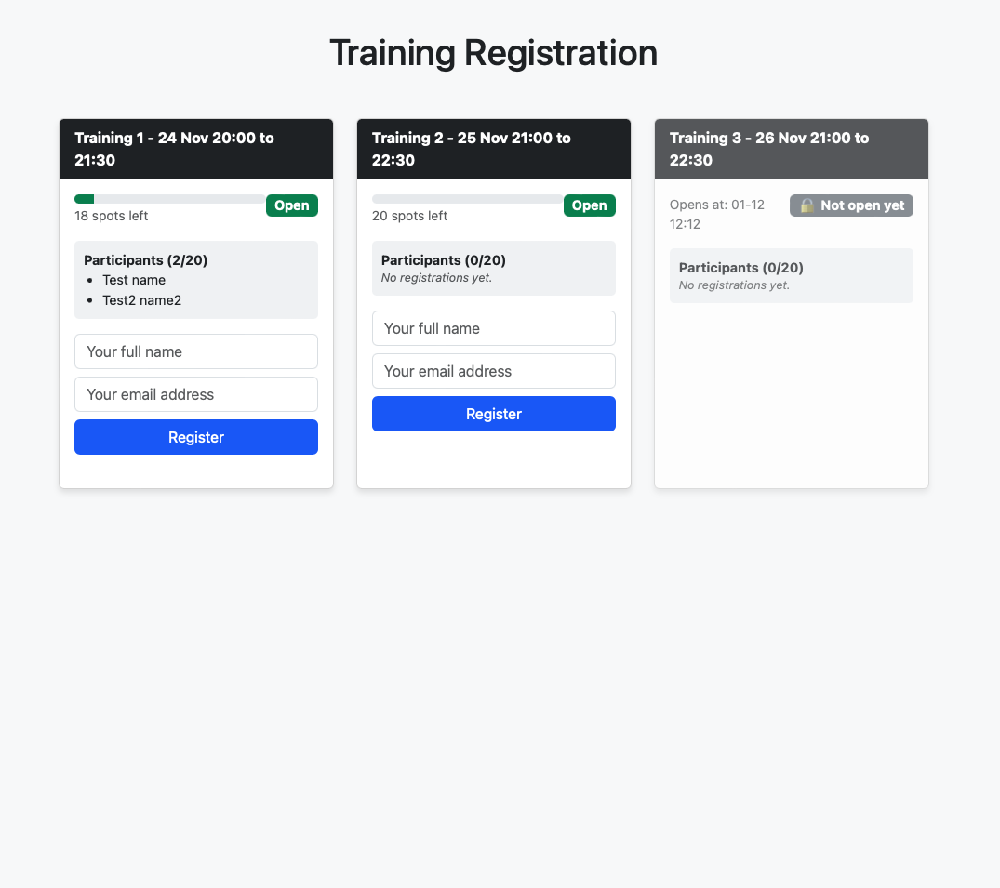
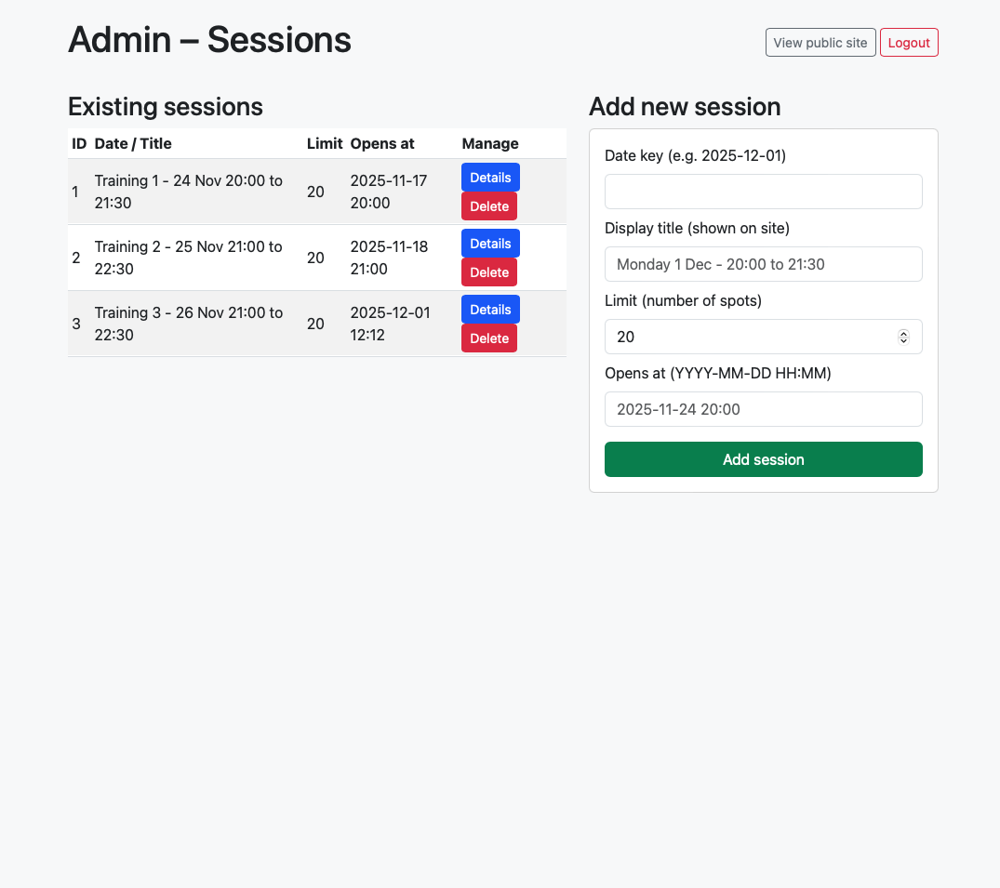
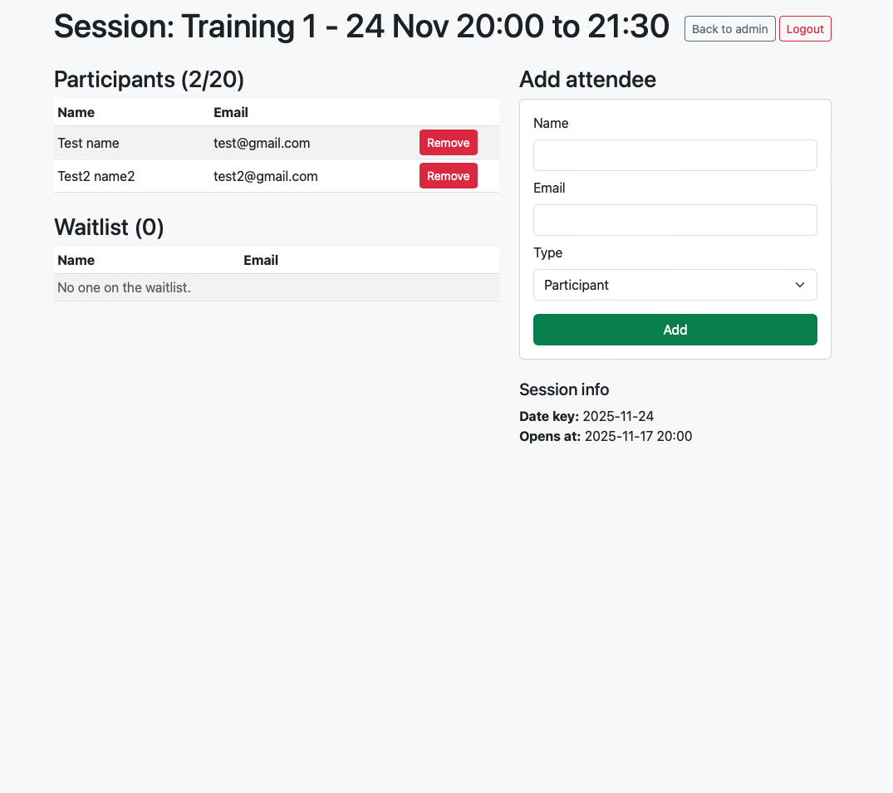

# Vereniging Inschrijf Systeem

Een eenvoudig, lichtgewicht webportaal voor verenigingen om inschrijvingen voor evenementen, trainingen of borrels te beheren. Gebouwd met Python en Flask.

## Functies

*   📅 **Evenementen Beheer**: Maak evenementen aan met datum, tijd en limiet aantal deelnemers.
*   📝 **Inschrijvingen**: Leden kunnen zich inschrijven met naam en e-mail.
*   ⏳ **Automatische Wachtlijst**: Als een evenement vol is, worden inschrijvingen automatisch op de wachtlijst geplaatst.
*   🔄 **Automatische Promotie**: Als iemand zich uitschrijft, wordt de eerste persoon op de wachtlijst automatisch ingeschreven en gemaild.
*   🔐 **Admin Dashboard**: Beveiligd gedeelte om deelnemerslijsten te bekijken en nieuwe events aan te maken.


## Installatie

1.  **Clone de repository:**
    ```
    git clone https://github.com/jouwnaam/vereniging-inschrijf-systeem.git
    cd vereniging-inschrijf-systeem
    ```

2.  **Vereisten installeren:**
    Zorg dat Python geïnstalleerd is en draai:
    ```
    pip install flask flask_sqlalchemy flask_login
    ```

3.  **Configuratie:**
    Open `app.py` en pas de `SMTP` instellingen aan als je e-mails wilt versturen.
    Verander ook de `SECRET_KEY` voor veiligheid.

4.  **Starten:**
    ```
    python app.py
    ```
    De database wordt automatisch aangemaakt bij de eerste keer opstarten.
    
    *Standaard Admin Login:*
    *   Gebruikersnaam: `admin`
    *   Wachtwoord: `password123`

## Gebruik

*   Bezoek `http://127.0.0.1:5000` om de evenementenlijst te zien.
*   Bezoek `http://127.0.0.1:5000/admin` om evenementen te beheren.

## Screenshots





## Deployen op PythonAnywhere (Gratis)

Je kunt dit systeem eenvoudig en gratis online zetten via [PythonAnywhere](https://www.pythonanywhere.com/).

1.  **Account & Bestanden:**
    *   Maak een gratis account aan en log in.
    *   Ga naar het tabblad **Files**.
    *   Upload `app.py`.
    *   Maak een nieuwe map genaamd `templates` aan en upload daar alle HTML-bestanden in.

2.  **Installeren pakketten:**
    *   Ga naar het tabblad **Consoles** en start een **Bash** console.
    *   Typ het volgende commando om de benodigde software te installeren:
        ```
        pip install flask flask_sqlalchemy flask_login
        ```

3.  **Web App Configureren:**
    *   Ga naar het tabblad **Web** en klik op **Add a new web app**.
    *   Klik op **Next** -> Selecteer **Flask** -> Selecteer **Python 3.10** (of de versie die je lokaal gebruikt).
    *   Bij "Path to your flask app", vul in: `/home/jouwgebruikersnaam/app.py` (let op: vervang `jouwgebruikersnaam` met je eigen accountnaam).

4.  **Klaar!**
    *   Klik op de groene **Reload** knop bovenaan de pagina.
    *   Je site is nu live op `https://jouwgebruikersnaam.pythonanywhere.com`.

**Let op bij PythonAnywhere:**
*   **Database pad:** Als je database foutmeldingen krijgt, moet je in `app.py` soms het volledige pad naar de database opgeven in plaats van alleen `sqlite:///vereniging.db`.
    *   Verander: `app.config['SQLALCHEMY_DATABASE_URI'] = 'sqlite:///vereniging.db'`
    *   Naar: `app.config['SQLALCHEMY_DATABASE_URI'] = 'sqlite:////home/jouwgebruikersnaam/vereniging.db'`


## Licentie

Dit project is gelicenseerd onder de **GNU General Public License v3.0 (GPLv3)**.
